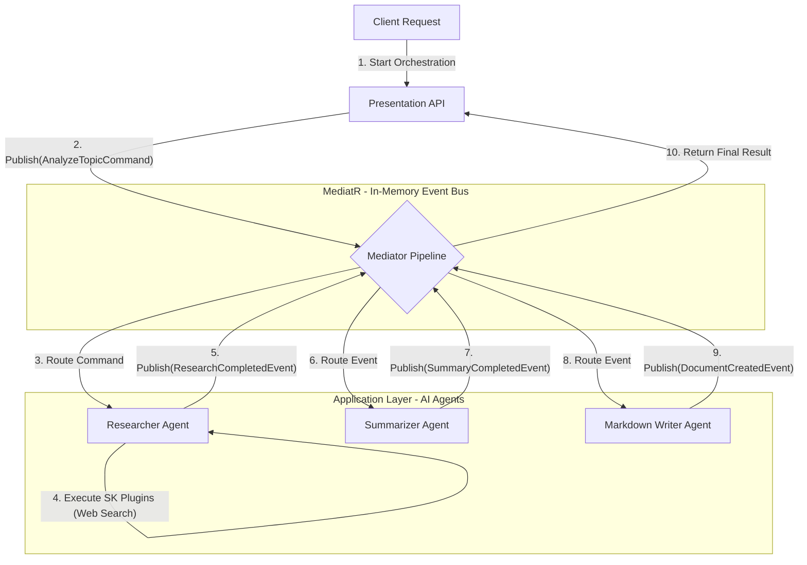

# NexusOrchestrator

NexusOrchestrator, birbirinden izole ve otonom çalışan yapay zeka ajanlarının (AI Agents) görevlerini merkezi bir olay veriyolu (Event Bus) üzerinden koordine eden, .NET tabanlı bir orkestrasyon motorudur.

Bu proje, geleneksel "spagetti" API çağrıları yerine, gevşek bağlı (Decoupled) bir mimari kullanarak ajanların birbirini tanımadan ortak bir hedefe ulaşmasını sağlar.

## Architecture & Design Patterns

Sistem, sürdürülebilirliği ve ölçeklenebilirliği garanti altına almak için aşağıdaki mimari desenler üzerine inşa edilmiştir:

1.  **Clean Architecture:** Çekirdek iş mantığının (Domain), dış dünyadan (Infrastructure/Presentation) tamamen izole edilmesi.
2.  **Event-Driven Architecture (EDA):** Ajanlar arası iletişimin doğrudan (Request/Response) değil, olaylar (Events) aracılığıyla asenkron olarak sağlanması.
3.  **Mediator Pattern (MediatR):** Sistem içi mesajlaşmanın tek bir merkezden yönetilerek bağımlılıkların (Coupling) en aza indirilmesi.
4.  **Semantic Kernel Integration:** Microsoft'un kurumsal AI standardı kullanılarak, ajanlara C# fonksiyonlarının "Yetenek" (Plugin/Tool) olarak tanımlanması.

## System Flow (Mermaid Diagram)

Aşağıdaki şema, kullanıcıdan gelen bir isteğin sistem içinde nasıl olaylara (Events) dönüştüğünü ve ajanlar arasında nasıl dolaştığını göstermektedir.

